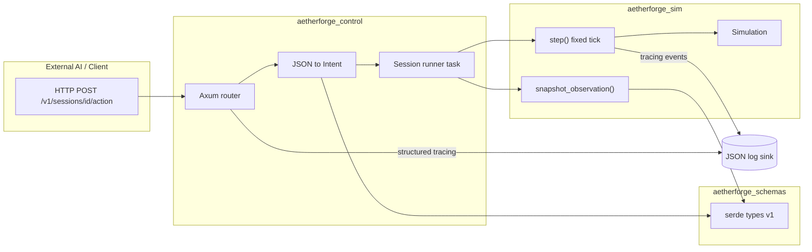

# Phase 1b — Subsystem architecture (AetherForge Engine)

This document describes crate boundaries, tick authority, headed/headless entrypoints, schema layout, and logging—aligned with Phase 1a (Rust sim kernel, Python tooling, no commercial engine as tick owner).

## 1. Crate / module boundaries

| Crate / area | Responsibility | Depends on |
|--------------|----------------|------------|
| **`aetherforge_sim`** | Authoritative world model, rules, fixed-tick `step`, RNG injectable, no window/network | `glam`, `serde`, `tracing` only (minimal deps) |
| **`aetherforge_platform`** | Headed: `winit` + `wgpu` loop; translates input → intents; renders debug/optional views | `aetherforge_sim`, `winit`, `wgpu` |
| **`aetherforge_control`** | HTTP/WebSocket (or SSE-first) server; JSON ↔ typed commands; session/run registry | `aetherforge_sim`, `tokio`, `axum` |
| **`aetherforge_schemas`** | Shared JSON Schema artifacts + Rust types (via `serde` + `schemars`); version constants | `serde`, `schemars` |
| **`aetherforge_game`** *(future / flagship)* | Farming-sim (or other) content: entities, content defs, game-specific systems registering into sim | `aetherforge_sim` |
| **`aetherforge_cli`** | Thin binary: `run headless`, `run headed`, `serve` subcommands | `aetherforge_sim`, optional `aetherforge_platform`, `aetherforge_control` |

Python **`aetherforge_sdk`** (separate tree or `python/` in workspace) consumes the same OpenAPI/JSON Schema contracts; it does not import Rust crates at build time.

## 2. Single tick / time authority

- **Authority:** `aetherforge_sim::Simulation` (or `WorldDriver`) owns **the** `step(dt: FixedTick)` (or discrete tick index) API. No other crate advances time without going through it.
- **Rate:** Fixed logical tick (e.g. `TICK_HZ = 60`); accumulator in the *caller* (platform or control) batches real time into integer tick counts; sim sees only `tick_index` + `fixed_dt`.
- **Pause:** Boolean or enum on `Simulation` (`Paused` skips rule progression but may still allow inspection APIs). Headed and headless callers read the same flag; control plane can set `pause` via command.
- **Who calls `step`:** Exactly one “runner” per session: either `headless_runner` loop or `platform` frame loop or `control` tick task—never both concurrently on the same `Simulation` instance without a defined ownership transfer (**UNTESTED** until concurrency story is implemented).

## 3. Headed vs headless entrypoints

| Entry | Binary / path | Behavior |
|-------|---------------|----------|
| **Headless** | `aetherforge_cli run headless --ticks N` (or library test harness) | Builds `Simulation`, loads seed/config, runs N ticks, writes logs/observations; no `winit`/`wgpu` linked when built with `--no-default-features` |
| **Headed** | `aetherforge_cli run headed` | `aetherforge_platform` creates window, attaches to same `Simulation` API as headless |
| **Serve** | `aetherforge_cli serve` | Runs `aetherforge_control` bound to a port; each session holds or references one `Simulation` (**UNTESTED**: exact session model) |

Shared API surface: construct `Simulation::from_config(Config)`, then `sim.step()`, `sim.snapshot_observation()`, `sim.apply_intent(Intent)` (names illustrative).

## 4. Versioned JSON schemas — repo layout and Rust mapping

```
schemas/
  v1/
    action.schema.json
    observation.schema.json
    control_envelope.schema.json
  README.md          # versioning policy: additive minor, breaking → v2 folder
```

- **Convention:** `schemas/v{n}/*.schema.json` are source of truth for external AIs; Rust structs live in `aetherforge_schemas::v1` mirroring filenames (e.g. `Action`, `Observation`).
- **Wire envelope:** Every control message includes `schema_version: "1.x"` (semver or integer policy TBD in 1c) (**UNTESTED**).

## 5. Logging pipeline (AI-tailable)

- **`tracing` spans/events** inside sim and control with stable target names: `aetherforge.sim.tick`, `aetherforge.control.request`, `aetherforge.game.event`.
- **Subscriber:** JSON lines to stdout and optional file (`AETHERFORGE_LOG_JSON=1`); each line includes `tick`, `run_id`, `level`, `target`, `fields` (**UNTESTED** until subscriber crate exists).
- **Human-readable play log:** Separate channel (file or SSE) that renders high-level narrative from the same events (**UNTESTED**).

---

## Diagram — REST action → tick → observation



**Trace narrative (hypothetical):** Client sends `POST .../action` with JSON matching `action.schema.json`. `aetherforge_control` validates → `Intent` → session runner queues intent, calls `sim.apply_intent`, then `sim.step()` once (or batches per policy). Runner builds `Observation` from `sim.snapshot_observation()`, serializes to JSON, returns HTTP 200. Each stage emits `tracing` JSON lines with `tick` and `run_id` for an external AI to tail.

---

## UNTESTED (no runnable proof yet)

- Headless and headed binaries share identical post-load behavior for the same seed and intent sequence.
- Concurrent sessions and thread safety of `Simulation` when served over HTTP.
- Exact shape of `Intent` / `Observation` fields and schema version negotiation.
- JSON log subscriber and play-log narrative pipeline.
- Pause + single-step from REST without race conditions.

---

### Documentation & Learning Log (Employee AI)

- **Accomplished this cycle:** Authored `docs/phase1b-subsystem-architecture.md` with crate table, tick authority, three CLI entrypoints, `schemas/v{n}/` convention, tracing-based logging, Mermaid flow for REST → step → observation, and **UNTESTED** list.
- **Processes used:** Phase 1b relay spec; kept sim kernel vs platform vs control separation consistent with 1a.
- **Pitfalls / observations:** Session ownership and concurrency are explicitly deferred—must be nailed in repo bootstrap + control plane slice.
- **Learnings / best practices:** One `step` owner + named runners avoids duplicate tick sources.
- **Next cycle action items:** Director review of 1b; then 1c (AI interface spec v0, risk register, minimal repo) per sequence.
